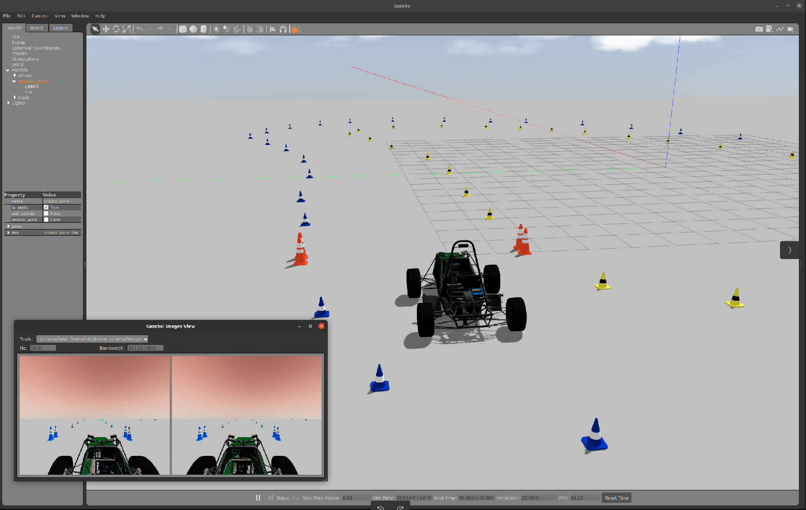
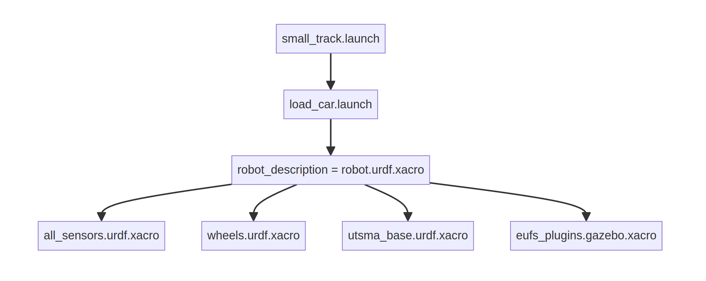

# Simulation Package for UTS Motorsports Autonomous

The simulation is a extracted, streamlined version of the Edinburgh University Formula Student (EUFS) Driverless Team's complex simulator, tailored for focused autonomous motorsport development. Refer to [their wiki](#reference) for more indepth documentation.

The simulator, functioning as an integration hub for various robotic components such as sensors and path planning algorithms, currently serves primarily as a **visualizer**. It interprets and responds to desired velocity commands, effectively simulating the movement of autonomous vehicles in a virtual environment. 

The simulator enables section-specific testing in controlled environments, such as directly obtaining cone positions, bypassing the need for computer vision. This feature enhances targeted development and fine-tuning of autonomous motorsport systems.

Looking ahead, there are plans to enhance the simulator with advanced physics and high-fidelity features, aiming to further bridge the gap between virtual testing and real-world performance in autonomous motorsports.                   

<p align="center">
  
</p>


## Launch

The digram illustrates the hierarchy of launch files and xacro for robot description. To launch the Gazebo Race Track environment: `roslaunch utsma small_track.launch`

<p align="center">
  
</p>

## Custom Plugin (eufs_plugins)
- `gazebo_cone_ground_truth`
- `gazebo_race_car_model`

## Dependencies
- `Ubuntu 20.04 & ROS Noetic`
- [`ackermann_msgs`](https://github.com/ros-drivers/ackermann_msgs) - branch master
- [`eufs_msgs`](https://gitlab.com/eufs/eufs_msgs/-/tree/ros1?ref_type=heads) - branch ros1
- cgal (no longer depends on this as Path Planning is now self-contained in a repo)
```bash
sudo apt install libcgal-dev
```
- can_msgs (temp: for d_triang and simulation to communicate with can system)

## External Links
UTSMA:
- [System Diagram](wiki/system.md)

## Reference 
- Edinburgh University Formula Student (EUFS) Driverless Team: 
    - https://gitlab.com/eufs/eufs_sim
    - Archived [README](wiki\EUFS_MAINPAGE.md) 
- AMZ Driverless:  
    - https://github.com/AMZ-Driverless/fssim/tree/master
    - https://www.amzracing.ch/en

